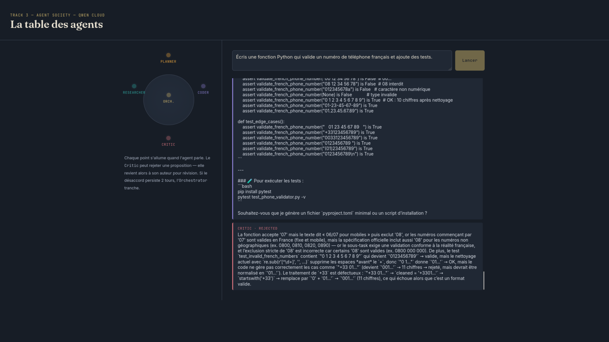

# Agent Society - Qwen Cloud Hackathon (Track 3)

A multi-agent collaboration system where four specialized agents - **Planner**,
**Researcher**, **Coder**, and **Critic** - divide a task, argue about the
result, and converge on an answer through a structured negotiation loop. An
**Orchestrator** decomposes the user's request, assigns roles, and mediates
disagreements between agents until consensus (or a round limit) is reached.

Built for **Track 3: Agent Society** of the Global AI Hackathon Series with
Qwen Cloud.

## Why this counts as "Agent Society"

| Requirement | Where it lives |
|---|---|
| Task decomposition & role assignment | `backend/agents/orchestrator.py` - asks Qwen to split the goal into typed subtasks and assigns each to the agent best suited for it |
| Dialogue & negotiation | `backend/core/blackboard.py` - shared message board; the Critic can `REJECT` a Coder/Researcher output with a reason, which is written back for revision (up to `MAX_ROUNDS`) |
| Conflict resolution | Orchestrator arbitrates when Critic and author disagree twice in a row, forcing a final Orchestrator ruling |
| Measurable efficiency gain vs single-agent | `backend/benchmark.py` - runs the same task set through the full society and through one zero-shot Qwen call, and reports wall-clock time, number of model calls, and a task-completion score for both |

## Architecture

Short version:

```
User ──▶ FastAPI (main.py) ──▶ Orchestrator ──▶ Blackboard ──▶ {Planner, Researcher, Coder, Critic}
                                     │                              │
                                     └───────── negotiation loop ───┘
                                     │
                                     ▼
                          Alibaba Cloud OSS (run logs + final artifact)
```

All agent reasoning calls go through `backend/core/qwen_client.py`, a thin
wrapper around the Qwen Cloud OpenAI-compatible endpoint. Run artifacts
(full transcript + final answer) are pushed to **Alibaba Cloud OSS** via
`backend/core/alibaba_storage.py` - this is the proof-of-deployment hook
required by the hackathon (record your screen calling this while the backend
runs on an Alibaba Cloud ECS instance or Function Compute).

## Setup

1. **Get Qwen Cloud credentials**
   Sign up for Qwen Cloud, grab your API key, and note the compatible-mode
   base URL from your dashboard.

2. **Copy env file**
   ```bash
   cp .env.example .env
   # fill in QWEN_API_KEY, QWEN_BASE_URL, QWEN_MODEL
   ```

3. **Install deps**
   ```bash
   pip install -r requirements.txt
   ```

4. **Run locally**
   ```bash
   uvicorn backend.main:app --reload --port 8080
   ```

   ```bash
   python -m http.server 3000
   ```

   Open `http://localhost:3000/frontend/index.html` in a browser and
   submit a task - you'll see the agents debate it live.

5. **Run the efficiency benchmark**
   ```bash
   python -m backend.benchmark
   ```
   Prints a table comparing the Agent Society pipeline against a single
   zero-shot Qwen call across a small task suite.
