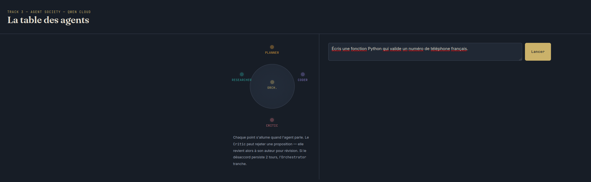
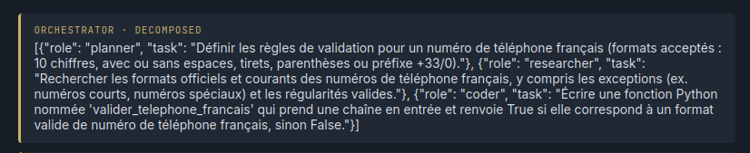
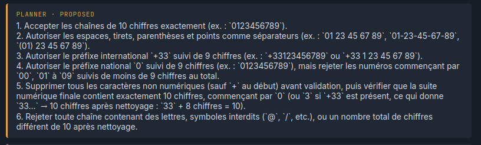
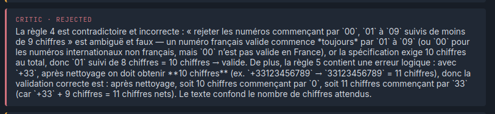
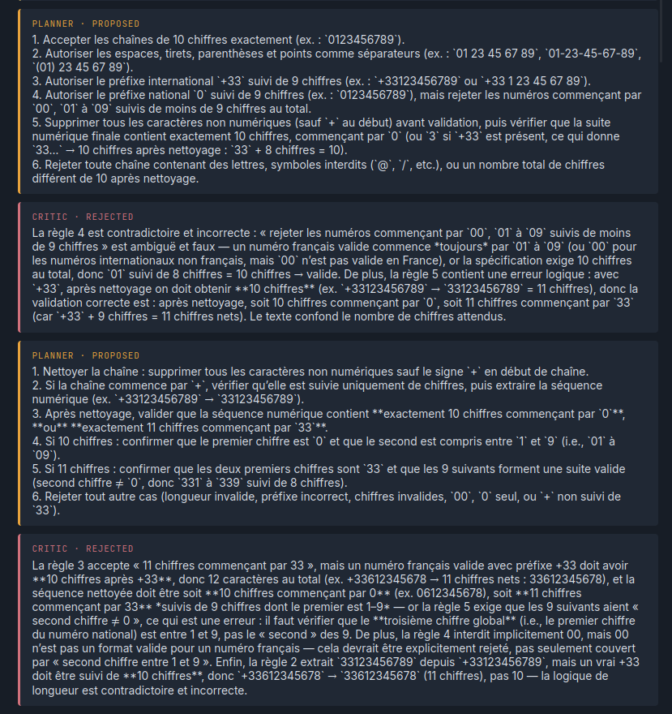
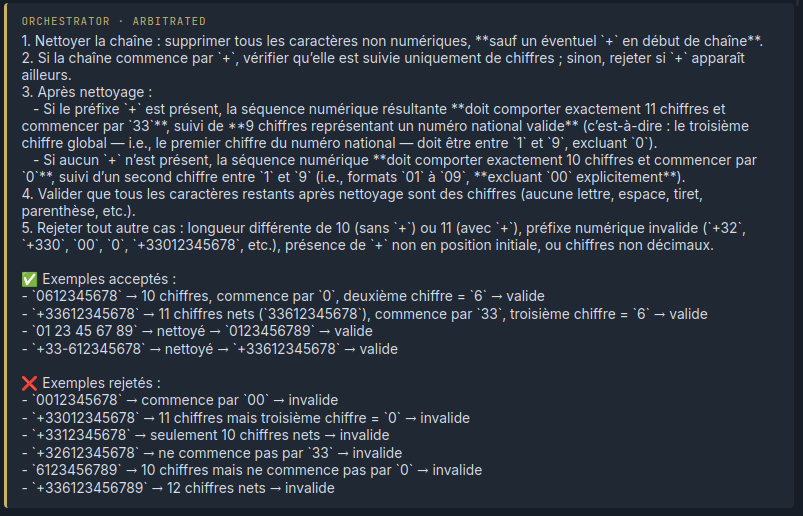
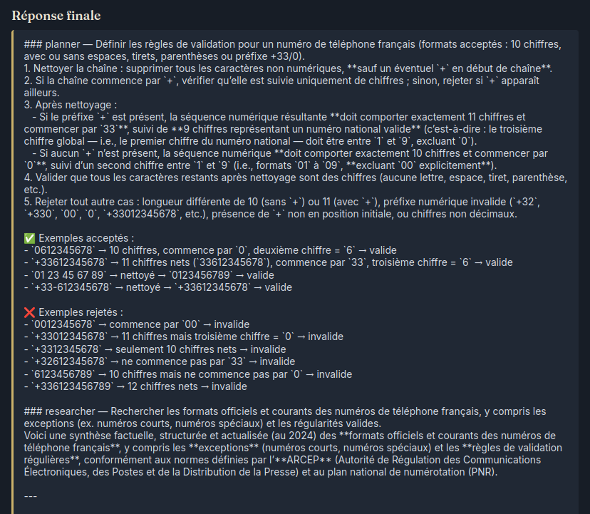

# Agent Society — Comment ça marche

Ce document explique, étape par étape, ce qui se passe quand tu envoies une
tâche dans l'interface. Chaque étape correspond à un screenshot à insérer.

---

## Étape 1 — L'utilisateur envoie une tâche

Tu tapes ta demande dans la zone de texte et tu cliques sur "Lancer".

---

## Étape 2 — L'Orchestrator divise la tâche

Le premier bot à parler est l'**Orchestrator**. Il ne résout rien lui-même :
il découpe la demande en 2-4 sous-tâches et décide quel agent s'occupe de
quoi (Planner, Researcher ou Coder). C'est le point de départ de toute la
négociation.

---

## Étape 3 — Un agent propose une solution

L'agent assigné (le plus souvent le **Coder**, parfois **Planner** ou
**Researcher** selon la sous-tâche) répond avec sa première tentative.

---

## Étape 4 — Le Critic juge la réponse

Le **Critic** relit la proposition et rend un verdict :
- ✅ **APPROVE** → la réponse est acceptée telle quelle, on passe à la suite.
- ❌ **REJECT** → il donne une raison précise, et la balle revient à l'agent
  qui avait proposé, pour qu'il corrige.

---

## Étape 5 — (si rejet) L'agent corrige sa copie

Si le Critic a rejeté, l'agent original reçoit la raison exacte et propose
une nouvelle version. Ce cycle propose → critique peut se répéter jusqu'à
3 fois.

---

## Étape 6 — (si désaccord persistant) L'Orchestrator tranche

Si un agent et le Critic n'arrivent toujours pas à s'entendre après 2
tours, l'Orchestrator arbitre lui-même et impose une version finale.

---

## Étape 7 — Réponse finale

Une fois toutes les sous-tâches approuvées (ou arbitrées), l'Orchestrator
assemble tout et affiche la réponse finale complète.

---

## Résumé en une phrase par bot

| Bot | Rôle en une ligne |
|---|---|
| Orchestrator | Découpe la tâche, assigne les rôles, tranche les désaccords |
| Planner | Transforme une sous-tâche en étapes concrètes |
| Researcher | Fournit le contexte factuel nécessaire |
| Coder | Écrit la solution technique |
| Critic | Approuve ou rejette avec une raison précise |
